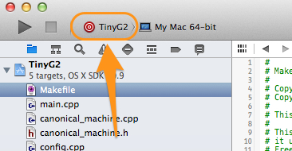

_This page is for compiling the G2 project on OS X with XCode. Please see [Getting Started with G2](Getting-Started-with-G2) for information about hardware and compiling on other platforms._

See also: [Debugging G2 on OSX with GDB and Atmel-ICE](https://github.com/synthetos/g2/wiki/Debugging-G2-on-OSX-with-GDB-and-Atmel-ICE)

## What's needed

To compile G2 on OS X with Xcode you will need to install XCode ([Mac App Store](https://itunes.apple.com/us/app/xcode/id497799835?mt=12)). Luckily, it's free.

_If you wish to use the OS X command line, then visit [[Compiling G2 on OS X and Linux (command line)]] as well._

## Cloning the git repository

The easiest way on OS X to clone the git repo is probably to use the GitHub OS X app.

1. Download and install the [GitHub app](https://mac.github.com/).
2. Log into the GitHub web site -- register if needed, it's free.
3. Browse to the [G2 project page](https://github.com/synthetos/g2) and then click on the `Clone in Desktop` button.
  * The GitHub application should open up, and ask where to save the new repository. The default location will probably be sufficient.
4. In the GitHub app, chose Branches on the left and then click on Edge to checkout the Edge branch.
5. (Convenience) In the `Repository` menu, choose `Open in Finder` to display the folder of the the newly checked out repo.

## Compiling

In the newly cloned repo, open the `TinyG2` folder, and then open the file named `TinyG2.xcodeproj`.

Ensure that the TinyG2 scheme is selected, as shown:

Now you can choose `Build` for the `Product` menu of Xcode (or click the "play" button in the top-left of the window) to build G2 for all supported "platforms" simultaneously.

The resulting files will be in `${projectRoot}/TinyG2/bin/`, in a folder named after the platform. For example, there will be a folder named `gShield` with a file named `gShield_flash.elf`.

## Uploading G2 to a target board and Debugging

- See [[Flashing G2 with OSX]]
- See [Degugging G2 on OSX with GDB and Atmel ICE](Debugging-G2-on-OSX-with-GDB-and-Atmel-ICE)

