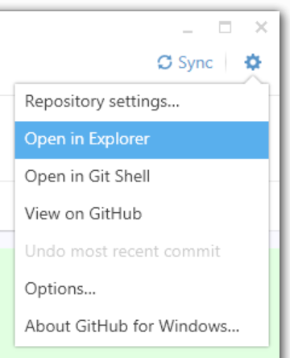
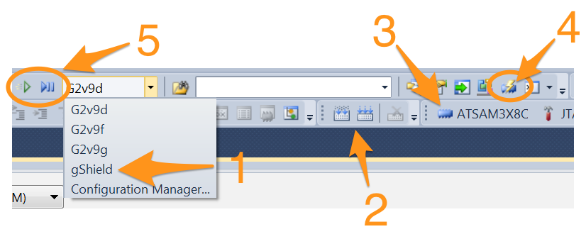

_This page is for compiling the G2 project on Windows 10 with Atmel Studio 6.2. Please see [Compiling G2](Compiling-G2) for information about hardware and compiling on other platforms._

**THIS PAGE IS STILL UNDER CONSTRUCTION**

## What's needed

To compile G2 on Windows with Atmel Studio you will need the last available Atmel Studio 6.2 (build 1548) Installer – with .NET. We recommend a clean machine or VM.

To flash the compiled software via Atmel Studio, you will want an Atmel Sam-Ice programmer/debugger (http://www.digikey.com/product-detail/en/AT91SAM-ICE/AT91SAM-ICE-ND/1008639). This will allow you to load and hardware debug the compiled code.

* Go to Atmel and download the [Atmel Studio 6.2 Installer – with .NET](http://www.atmel.com/tools/atmelstudio.aspx) install package.
  * The current build is build 1548. Do not use an earlier build - e.g. 1153 - as it has serious bugs in the debugger (how ironic).
  * Be sure to get the one **including the .NET part**. It's about 800 Mbytes.
  * They require you to either register or fill out a "guest" form. Otherwise it's free.
* Walk through the entire installation process. 
  * You **will not** need the Atmel Solutions framework when asked.
  * You **will** need the USB drivers when asked.

**Note: do NOT use an ASF project (like the Arduino Due board) when setting up you project! It's best not to even download ASF. When asked to update it, don't do it** 

## Cloning the git repository.

The easiest way on Windows to clone the git repo is probably to use the GitHub Windows app.

1. Download and install the [GitHub app](https://windows.github.com/).
2. Log into the GitHub web site -- register if needed, it's free.
3. Browse to the [G2 project page](https://github.com/synthetos/g2) and then click on the `Clone in Desktop` button.
  * The GitHub application should open up, and ask where to save the new repository. The default location will probably be sufficient.
4. In the GitHub app, click on the unnamed menu in the top-left and then click on `edge` to checkout the edge branch. 

5. (Convenience) From the gear menu in the top-right of the Github window choose "Open in Explorer" to show the location of the newly checked-out repo. 

## Compiling and uploading with Atmel ICE

_Note:_ Many of these instructions will work with the Atmel SAM-ICE as well.

In the project directory all of the source files and the Atmel project files for Studio 6 are inside the `TinyG2` directory. Once Atmel Studio 6.2 is installed, open the solution file `TinyG2.atsln`. (Atmel studio will also open the project file `TinyG2.cppproj` automatically.)

_Note:_ Git is configured to ignore the changes to some of the project's dependent files so that they don't cause havoc. This means that to commit changes to those files, they need to specifically be added to the commit by name.

To compile the project:

1. Choose the platform you are building for (for the Due with gShield pinout, choose `gShield`).
2. Click either the "Build Project" or "Build Solution" buttons -- they are the same in this case. (These can also be found in the Build menu.)
  * This will create a file named `TinyG2.elf` and another named `TinyG2.bin`, both in the `TinyG2` folder.
  * You will need one of these files to upload to the board. With option 5, below, it will use this file automatically. All other ways of uploading to the board will require you to locate this file manually.
3. Configure the Device and Atmel-ICE Tool in the TinyG project Properties window, which can be found by right clicking the TinyG2 root directory in the Solution Explorer pane.
  * In the Device tab select one of: `ATSAM3X8C` for a v9 board, or `ATSAM3X8E` for the Due
  * In the Tool tab select your `Atmel-ICE`, which must be plugged in for it to appear. If you have more than one plugged in you can identify them by the last 4 digits of the serial number.
  * The Interface must be `SWD`. JTAG doesn't work.
  * You can now program and debug the buttons labeled '5' in the picture, as per step 5, below.
4. (Alternately) Connect, configure and test the Atmel-ICE Tool in the Device Programming window: 
  * The Tool should be Atmel-ICE. If you have more than one connected identify by the last 4 digits of the serial number.
  * The Device is one of: `ATSAM3X8C` for a v9 board, or `ATSAM3X8E` for the Due
  * The Interface must be `SWD`. JTAG doesn't work.
  * Hit Apply
  * You can hit Read the Device Signature to verify that you are connected. Or just hit the Memories tab
  * Program from the Memories tab. Make sure the file selected is the TinyG2.elf in the main TinyG2 directory. You can also use this option to program _any_ binary (particularly useful if you didn't compile it).
5. To compile and upload without debugging (left) or with debugging (right) click one of these two buttons. These are also available from the Debug menu.

## Uploading G2 to a target board (without a Atmel ICE)

To flash G2 (using the TinyG2.bin file you just made in step 2 above) onto a target board _without_ using a debugger such as the Atmel ICE or Atmel SAM-ICE, please visit the [[Flashing G2 with Windows]] page.