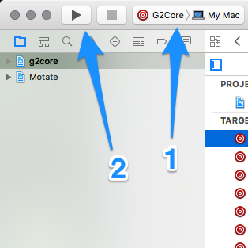
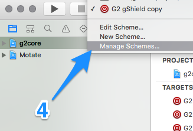

_This page is for compiling the G2core project on OS X with XCode. Please see [Getting Started with G2core](Getting-Started-with-G2core) for information about hardware and compiling on other platforms._

See also: [Debugging g2core on OSX with GDB and Atmel-ICE](https://github.com/synthetos/g2/wiki/Debugging-g2core-on-OSX-with-GDB-and-Atmel-ICE)

## What's needed

To compile g2core on OS X with Xcode you will need to install the free XCode. Download the installer from the [Mac App Store](https://itunes.apple.com/us/app/xcode/id497799835?mt=12). Alternatively, if you only need the command line tools, you can run this command in Terminal: `xcode-select --install`).

_If you wish to use the OS X command line, then visit [[Compiling g2core on Linux and OS X (command line)]] as well._

## Cloning the git repository

See [Getting Started with G2core → Cloning the Repo](Getting-Started-with-G2core#cloning-the-repo) if you haven't already.

## Compiling

In the newly cloned repo, open the `g2core.xcworkspace`.

Ensure that the "g2core" scheme to your target board is selected, as shown (Step 1):

Now you can choose `Build` for the `Product` menu of Xcode (or click the "play" button in the top-left of the window, marked as "2" above) to build g2core for all supported "platforms" simultaneously.

The resulting files will be in `${projectRoot}/g2core/bin/`, in a folder named after the platform and board. For example, there will be a folder named `PrintrbotSimple1608-printrboardG2v3` with a file named `g2core.elf` (among others).

## Creating a new Target

If you have [created a new `BOARD` or `CONFIG`](https://github.com/synthetos/g2_private/wiki/Adding-and-Revising-Boards) (or wish to use a different `SETTINGS_FILE`) then you will need to make a new target so that XCode will compile it corrrectly.

1. Click on "g2core" in the file navigator and find an existing target that is similar to the one you are planning to use.

1. Right-click on that target in the list and choose "Duplicate". The new copy will show up in the list. Double-click on the name to change it.

1. With the new Target selected, click the Info tab at the top and modify the command line as necessary.
  - Generally, you will want to add `COLOR=0 VERBOSE=1` to the command line you would call from the shell prompt so Xcode can parse the output properly.

  

1. In the scheme menu (top left, next to the play and stop buttons) you should see the name of the copy you made earlier (before you changed the name). Click on that to get a menu, and chose "Manage Schemes..." from the bottom of the list.

  

1. To change the name you first click on the name, then click on it *again* and release the mouse but hold the mouse still. Then the name will become editable text. Change the name (generally we match this name to the Target name) and then hit return to commit the change.

1. In this same window, check the checkmark in the "Shared" column to put that scheme where it will be committed by Git. Leave it unchecked and you'll be the only one that sees it, and it will be deleted if you reset the repo.

1. Click the close button when you're done, or if you wish to verify or alter the target settings you can double-click on them. (We only care that the correct Target is listed in the Build step. You can add multiple if you wish.)

## Uploading G2 to a target board and Debugging

- See [Debugging g2core on OSX with GDB and Atmel ICE](Debugging-G2-on-OSX-with-GDB-and-Atmel-ICE)
